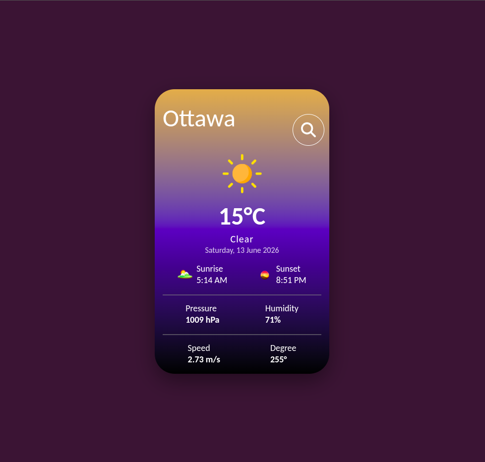
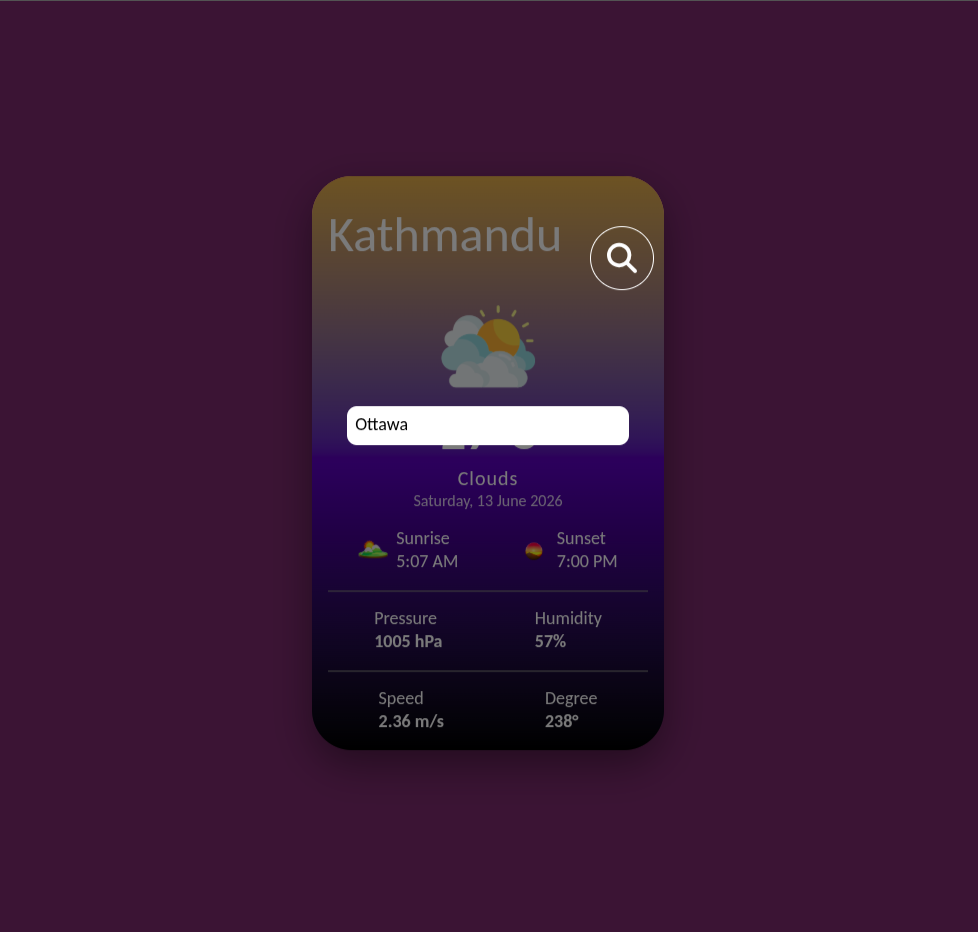
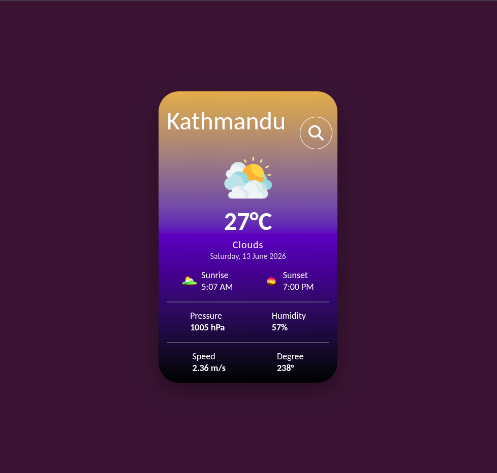

# Weather App

A simple and responsive weather application built using **HTML, CSS, and JavaScript**.

## Features

* Search weather by city name
* Real-time weather data using OpenWeather API
* Temperature, humidity, pressure, and wind information
* Sunrise and sunset timings
* Dynamic weather icons
* Clean and modern UI

## Technologies Used

* HTML
* CSS
* JavaScript
* OpenWeather API

## Screenshot

   

## Author

Made by Shulabh Sapkota.
